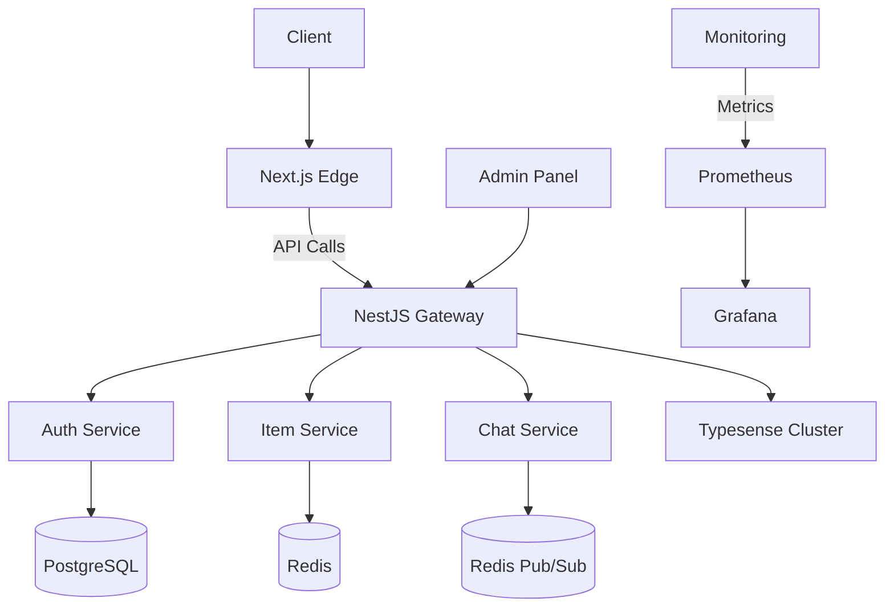

# CalTrade - California Chinese Community Marketplace

**A localized marketplace platform for Chinese communities in California**  
🌍 Live Demo: https://cal-trade.vercel.app | 📚 API Docs: https://api.cal-trade.dev/docs

## Table of Contents
- [Features](#features)
- [Tech Stack](#tech-stack)
- [Architecture](#architecture)
- [Installation](#installation)
- [Configuration](#configuration)
- [Deployment](#deployment)
- [Contributing](#contributing)
- [FAQ](#faq)
- [License](#license)
- [Authentication System Implementation](#authentication-system-implementation)

## Features
### Core Functionality
- **Location-Based Discovery**
  - Radius filtering (5km/10km/20km)
  - Map visualization with clustering
- **User System**
  - WeChat OAuth + SMS verification
  - Reputation scoring system
- **Item Management**
  - Multi-image/video upload (WebP optimization)
  - Automatic NSFW content detection
- **Real-Time Communication**
  - WebSocket-based chat
  - Push notifications
- **Search**
  - Chinese/English bilingual search
  - Pinyin fuzzy matching

### Admin Features
- Content moderation dashboard
- Analytics dashboard (Sales trends, user activity)
- Bulk operations API

## Tech Stack
### Frontend
| Component          | Technology             | Version |
|--------------------|------------------------|---------|
| Framework          | Next.js 14 (App Router)| 14.2.3  |
| State Management   | Zustand + React Query  | 4.0.0   |
| Mapping            | MapLibre GL + Turf.js  | 3.1.0   |
| UI Library         | Shadcn/ui              | 0.6.0   |
| Internationalization| next-intl              | 3.6.0   |

### Backend
| Component          | Technology             | Version |
|--------------------|------------------------|---------|
| Framework          | NestJS                 | 10.0.0  |
| ORM                | Prisma                 | 5.7.1   |
| Real-Time          | Socket.IO              | 4.7.2   |
| Search Engine      | Typesense              | 0.25.0  |
| Task Queue         | BullMQ                 | 5.2.0   |

### Infrastructure
| Service            | Provider               | Usage           |
|--------------------|------------------------|-----------------|
| Database           | PostgreSQL (Supabase)  | 15+ with PostGIS|
| Cache              | Redis (Upstash)        | 7+              |
| Object Storage     | Supabase Storage       | S3-compatible   |
| Monitoring         | Grafana Cloud          | Free Tier       |
| CI/CD              | GitHub Actions         | -               |

## Architecture

## Authentication System Implementation

### Core Components

1. **User Authentication Methods**:
   - WeChat OAuth2 integration using a custom provider
   - SMS verification with Twilio for phone-based authentication
   - JWT token management for secure sessions

2. **Database Schema**:
   - User model with support for multiple authentication methods
   - Account model for OAuth providers
   - Session model for managing user sessions
   - VerificationToken model for email/phone verification

3. **Authentication Flow**:
   - Sign-in page with WeChat and phone authentication options
   - SMS verification code generation and validation
   - Error handling and user feedback

4. **Security Features**:
   - JWT-based sessions with Redis for storage
   - Rate limiting for SMS verification
   - Secure token handling and validation
   - Type-safe authentication with Zod validation

5. **User Experience**:
   - Clean sign-in interface
   - Profile display on successful authentication
   - Route protection with middleware
   - Proper error handling and user feedback

### Technical Implementation

1. **NextAuth.js Configuration**:
   - Custom WeChat OAuth provider
   - Phone-based credentials provider
   - JWT session strategy
   - Custom callbacks for token and session handling

2. **Prisma Database Integration**:
   - Schema definition for users and authentication
   - Adapter integration with NextAuth.js
   - Type-safe database queries

3. **Redis Integration**:
   - Session storage
   - Verification code storage with expiration
   - Rate limiting implementation

4. **TypeScript Type Safety**:
   - Custom type declarations for NextAuth.js
   - Zod validation for user inputs
   - Type-safe API routes and components

### Next Steps

To complete the implementation, you would need to:

1. Set up a PostgreSQL database and update the connection string in `.env`
2. Set up a Redis instance and update the connection string in `.env`
3. Register for WeChat developer account and obtain OAuth credentials
4. Register for Twilio account and obtain SMS API credentials
5. Run database migrations with `npx prisma migrate dev`

## License